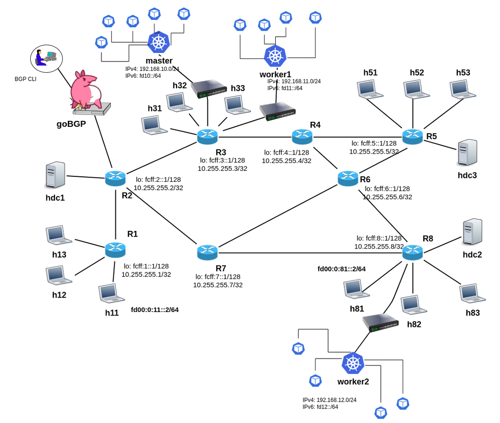

# srv6-calico-vpp-tests
Collection of scripts for testbed deployment, for k8s environments with Calico-VPP and SRv6 enabled.
Tested on Ubuntu 20.04 machine with 8 CPU and 16 GB RAM

## Requirements
- git-lfs (curl -s https://packagecloud.io/install/repositories/github/git-lfs/script.deb.sh | sudo bash)
- vagrant
- mininet

## Installation

Start by cloning this repository with all the submodules and git-lfs:
``` sh
    git clone --recurse-submodules git@github.com:zvfvrv/srv6-calico-vpp-tests.git
    git-lfs pull
```
be sure that the submodules are pulled(./mininet/rose-srv6-tutorial) and the docker images are downloaded (./docker/).
    
install the required packages:
``` sh
    $ sudo apt-get update
	$ sudo apt-get install -y jq nfs-kernel-server qemu-kvm libvirt-daemon-system \
		libvirt-clients bridge-utils qemu ebtables dnsmasq-base libxslt-dev \
		libxml2-dev libvirt-dev zlib1g-dev ruby-dev build-essential \
		libguestfs-tools
	$ sudo chmod a+r /boot/vmlinuz*	# Required for libguestfs
	$ sudo adduser `id -un` libvirt
	$ sudo adduser `id -un` kvm
	$ wget https://releases.hashicorp.com/vagrant/2.2.14/vagrant_2.2.14_x86_64.deb
	$ sudo dpkg -i vagrant_2.2.14_x86_64.deb
	$ rm vagrant_2.2.14_x86_64.deb
	$ vagrant plugin install vagrant-libvirt
	$ newgrp libvirt
```
### Installation of Mininet

Check if Mininet is installed by running:
```
$ /usr/bin/mn --version
```

If Mininet is not installed, run the install command (for Ubuntu/Debian):
```
$ sudo apt-get install mininet
```

### Installation of FRRouting suite (FRR)

You need to have FRR installed in order to run the mininet labs.
Check if FRR is installed by running:
```
  
  /usr/lib/frr/zebra -v
```

If FRR is not installed, follow these instructions (for Ubuntu/Debian): 

1) wget https://deb.frrouting.org/frr/keys.asc

2) sudo apt-key add keys.asc

3) rm keys.asc

4) run lsb_release -s -c

5) Edit the sources.list file in the /etc/apt folder, adding the following line at the end:
```

deb https://deb.frrouting.org/frr <release> frr-stable	
```
replacing <release> with the output of lsb_release -s -c 

6) sudo apt update

7) sudo apt -y install frr frr-pythontools


### Building vagrant base image

``` bash
$ # build vagrant image 
$ make build-base-box
```

## Scenario1

### Requirements
Install all the python packages required for the scenario1:
``` bash
$ make create-python-venv
$ make install-python-dependencies
```

### Deploy Scenario1 with TE-ConfigMap

Deploy the mininet testbed with the node of the k8s cluster:

```sh
    $ make start-scenario1
```
After the testbed is started, we need to congigure the k8s cluster with calico-vpp and srv6 enabled.
```sh
    $ #connect to the master node
    $ ssh vagrant@192.168.10.254 # password: vagrant
    $ # deploy calico-vpp with srv6 enabled 
    $ kubectl apply -f yaml/test-srv6.yaml
    $ # create ippools
    $ kubectl apply -f yaml/test-srv6-res.yaml
    $ # create configmap resource with srv6 config
    $ kubectl apply -f yaml/configMap.yaml
```

After that we can check that all the pods are running:
```sh
    $ kubectl get pods -A -o wide
```

#### Check the SRv6 configuration inside vpp

We can check the SRv6 configuration inside vpp by running the following command:

```sh
    $ kubectl -n calico-vpp-dataplane exec -it <calico-vpp-node-podname> -c vpp -- vppctl
```
from the vppctl prompt, we can

show the localsids:

    vpp# sh sr localsids

show the SR policies:

    vpp# sh sr policies

show the SR steering-policies:
    
    vpp# sh sr steering-policies

#### SR-TE with congifmap

edit the configmap file in yaml/configMap.yaml and applay the changes:

    $ kubectl apply -f yaml/configMap.yaml

then we can check the SRv6 configuration inside vpp:

    vpp# sh sr policies

and

    vpp# sh sr steering-policies

### Deploy Scenario1 with TE-BGP

.....

### Entering the mininet node (unamed namespace)

For instance, want to enter into the mininet node called `r3`:

    $ make enter-in name=r3


### Cleanup the deployment

The following commands can be used to cleanup the deployment:
```sh
    $ make destroy-scenario1
```